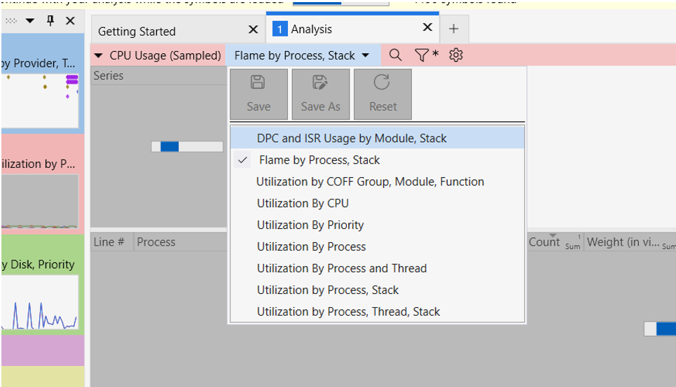
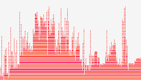

Most profiling guides are for Unix platforms and use specific commands like `perf`. Popular tools, such as `cargo flamegraph`, can be used with Windows but can be difficult/ impossible to set up correctly. Microsoft provides a whole suite of performance profiling tools, but they aren't documented that well, so they are hard to use outside Visual Studio.

Here is how I have worked out how to produce flame graphs to profile Rust code on Windows.
If you know of a better way, let me know!

1. Install [Windows Performance Analyzer](https://learn.microsoft.com/en-us/windows-hardware/test/wpt/windows-performance-analyzer).

   You can download it as part of the "Windows Assessment and Deployment Kit" or download it from the [Windows Store](https://apps.microsoft.com/detail/9n0w1b2bxgnz), which includes everything you need.

2. Compile the Rust program which you want to profile.

   You want to compile it in release mode to match the actual use cases of your binary but will need debug symbols so you understand where each part of the trace is. If you add this to your `Cargo.toml`:

   ```toml
   [profile.bench]
   debug = true
   ```

   If you build your binary with the `bench` profile, it should all work properly.

   ```bash
   cargo build --profile=bench
   ```

3. Record the performance trace with `xperf`.

   `xperf` will have been installed alongside Windows Performance Analyzer. It needs administrator privileges to run because it records the entire system.

   ```bash
   xperf -on Diag+Profile -stackwalk Profile && .\target\release\YOUR_BINARY_NAME.exe && xperf -d OUTPUT_NAME.etl
   ```

   Replace `YOUR_BINARY_NAME` with the name of the binary which you have compiled. You can also pass any flags or arguments you want. Also, replace `OUTPUT_NAME` with what you would like to call the trace file.

   The command starts recording all the relevant events across the system before running your command and saving everything it has recorded into a file.

   The binary you run will likely need to be a benchmark or stress test to ensure it is long enough to get profiled.

4. Open Windows Performance Analyzer and open your `.etl` file
5. Load symbols, so you can see what each part of the flamegraph refers to.Load symbols so you can see what each part of the flamegraph refers to.

   Go to `Trace` > `Configure Symbol Path`, and add your `/target/release` folder to the list of symbol locations. By specifying the path, Windows Performance Analyzer can find the function names for your code.

   Then select `Trace` > `Load Symbols`. A progress bar should now be showing at the top, and it will take a while to load everything (a long time...).

6. View the flamegraph.

   Double-click the pinkish `Computation—CPU Usage (Sampled)` to bring the analysis to the main area.

   Select `Flame by Progress, Stack` in the second dropdown in the toolbar. (See screenshot.)

   

   Then click the small graph icon and select `Flame`.

   Then, use the search next to it to find the binary name. Once you have found your binary, right-click on the process and select `Filter to Selection`.
   You can now view the flamegraph for just your binary.

7. Have fun profiling!

   
